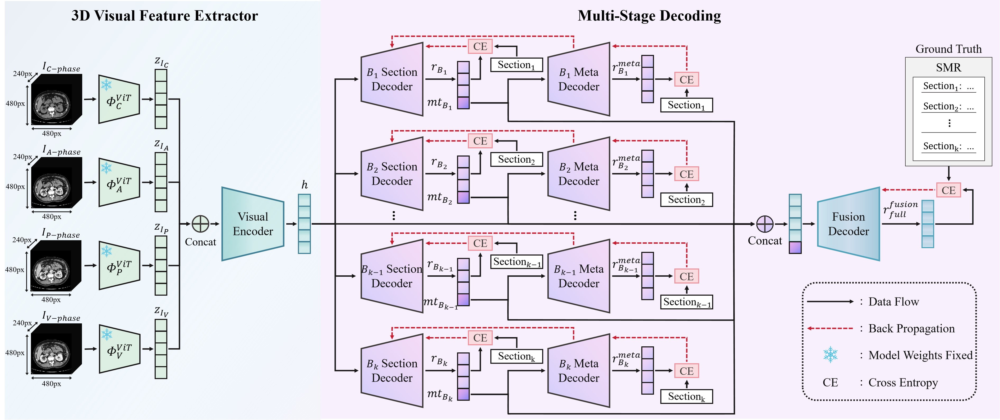

# CT2SMR: Structured Medical Report Generation using Multi-stage Decoding with Meta Tokens
The code of CT2SMR will be provided here！

## Framework

CT2SMR (Computed Tomography to Structured Medical Report) is a novel multi-stage decoding model featuring implicit meta-token learning. CT2SMR employs a multi-stage decoding architecture that leverages meta tokens to improve both intra-section coherence and inter-section consistency. The
model comprises three primary components: (1) a multi-phase 3D visual feature extractor, (2) a two-stage decoding process with implicit meta token generation, and (3) a final fusion decoder to synthesize the complete structured report.

